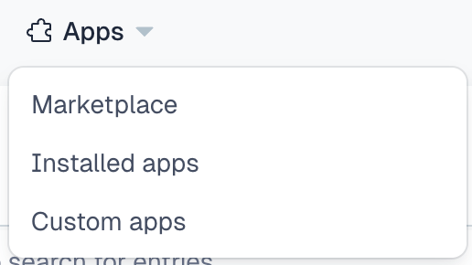
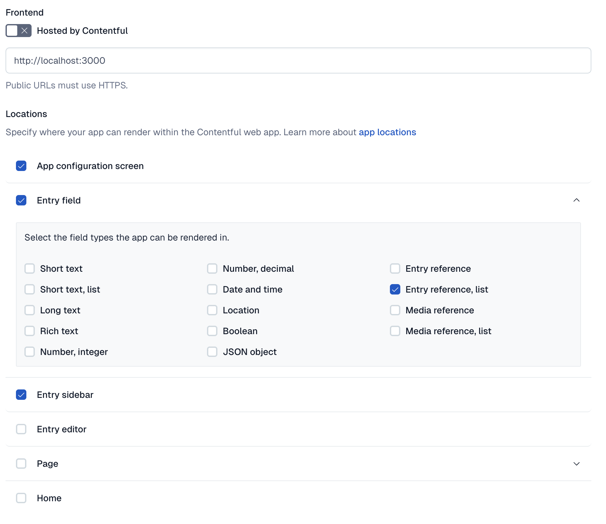

# Contentful module visualization UI extension

## Project details

### Elevator pitch

A Contentful plugin for a new entry-list selector field control which can help alleviate a lot of the problems & confusion that many clients have when we try to introduce them to Contentful during project handoffs.

### Problem / Opportunity

Contentful’s UI lacks any good opportunities for visual representation of what an entry actually looks like when filled out and placed on a site. This means that when clients are going through a site-handoff, we have historically had to write a lot of documentation or pass off Figma files that explain what certain names mean. However, the process of manually correlating and differentiating names is incredibly clunky (e.g. “Primary Hero” vs “Homepage Hero” vs “FiftyFifty Hero”).

While using Contentful’s preview-mode can give a good perspective on how an existing page is constructed, many clients seem to get lost when it comes to creating new pages. This issue has also often added a lot of late-stage friction in projects that slows down completion timelines.

The plan here is to use Contentful’s UI Extension framework and their Forma36 UI library to create a plugin that allows for inline visualization & documentation to give client content editors better context for what an entry name is actually representing.

### Proposed Outcome

#### Phases

1. A functional prototype for just the entry visualization plugin which can be internally installed into client projects by deploying & configuring it directly to a client’s Contentful space.
2. A brown-bag/tech-talk discussion with greater technical organization to help normalize getting this tool into practice.
3. An extended version of the functional prototype which adds a configuration page to manage the technical side of the plugin setup.
4. Deploying completed product the the Contentful Marketplace

## Technical details

### Project layout

```
src/
  index.tsx                        # root render; SDKProvider + SWRConfig, or the localhost warning
  App.tsx                          # map SDK locations to a component
  config/
    AppInstallationParameters.ts   # zod schema + defaults for installation parameters
  locations/                       # one folder per Contentful app location
    ConfigScreen/                  # app configuration screen (the installation UX)
    Field/                         # the entry-list field control
    Dialog/                        # modal documentation viewer
    Sidebar/                       # collapsible documentation panel on the entry editor
    EntryEditor/, Home/, Page/     # untouched create-contentful-app scaffolding
  components/
    Documentation/                 # fetches + renders a content type's documentation rich text
    EmbeddedAsset/                 # rich-text embedded-asset renderer
    LocalhostWarning.tsx
  hooks/                           # SWR-backed CMA reads + installation-parameter access
```

### Local development

#### Initial setup

```bash
npm install
npm run dev
```

#### Contentful space setup

When introducing this plugin for developer testing into a space, your user must have the ability to install custom apps into the space.



If you have this capability, you can click on the above menu and then select `<> Manage App Definitions` and then `Create app`. You can then set up the app with the initial settings shown below.



### Resources

- Contentful docs
  - [App SDK Reference](https://www.contentful.com/developers/docs/extensibility/app-framework/sdk/)
  - [React Apps Toolkit](https://www.contentful.com/developers/docs/extensibility/app-framework/react-apps-toolkit/)
  - [Create Contentful App CLI](https://www.contentful.com/developers/docs/extensibility/app-framework/create-contentful-app/)
- [Official create-contentful-app NPM package](https://www.npmjs.com/package/create-contentful-app)
- [Forma36 design system & components](https://f36.contentful.com/)
